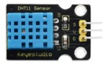

# Component List and Pin Configuration

This document provides a list of components used in the project along with their descriptions, pin configurations, manufacturer information, quantities, and images.

## Components

| Component          | Description                    | Pin Configuration                                                                                     | Manufacturer                     | Qty | Images  |
|--------------------|--------------------------------|-------------------------------------------------------------------------------------------------------|----------------------------------|-----|---------|
| DHT11 Sensor       | Indoor Temperature Sensor      | G: A pin that connects to ground V: A pin that connects to a +5V power supply S: A pin that connects to digital port. In our case, our digital pin is 13 |                                  | 1   |  |
| 47KResistor        | LM35                           | LM35                                                                                                  |                                  |     |         |
| 10KResistor        | Resistance Photo resistor      |                                                                                                       | KS0505 (STEM Starter Kit for Arduino) | 2   |  |
| 220Resistor        | Resistance LED                 | LED                                                                                                   | KS0505 (STEM Starter Kit for Arduino) | 1   |  |
| 3,3KResistor       | Resistance Motor DC/TIP122     | TIP122                                                                                                | KS0505 (STEM Starter Kit for Arduino) | 1   |         |
| 4,7KResistor       | Resistance DHT11               | DHT11                                                                                                 | KS0505 (STEM Starter Kit for Arduino) | 1   |         |
| 1602 I2C LCD       | LCD information screen         | GND: A pin that connects to ground VCC: A pin that connects to a +5V power supply SDA: A pin that connects to analog port A4 for IIC communication SCL: A pin that connects to analog port A5 for IIC communication | KS0505 (STEM Starter Kit for Arduino) | 1   |  |
| 130 Motor Propeller| Fan                            | 130 Dc Motor                                                                                          | KS0505 (STEM Starter Kit for Arduino) | 1   |  |
| 130 Dc Motor       | DC motor for fan               | Pin 3                                                                                                 | KS0505 (STEM Starter Kit for Arduino) | 1   |  |
| Stepper Motor      | Motor for opening and closing shutters | Pin 8, 9, 10, 11                                                                                        | KS0505 (STEM Starter Kit for Arduino) | 1   |  |
| PIR motion Sensor  | Motion Sensor                  | G: A pin that connects to ground V: A pin that connects to a +5V power supply S: A pin that connects to digital port. In our case, our digital pin is 2  | KS0505 (STEM Starter Kit for Arduino) | 1   |  |
| Servo Motor        | Opening and closing of window  | Black line is for GND Red one for power 5V Yellow one for signal terminal (PWM signal). In our case, our digital pin is 7 | KS0505 (STEM Starter Kit for Arduino) | 1   |  |
| Photoresistor      | Illumination Sensor            | Pin A2, A1                                                                                             | KS0505 (STEM Starter Kit for Arduino) | 2   |  |
| LED-Red            | Indoor light bulb home         | Digital Pin 6                                                                                          | KS0505 (STEM Starter Kit for Arduino) | 4   |  |
| TIP122 Transistor  | Auxiliary DC motor             | Pin ground Pin 130 Dc Motor Pin 5V                                                               | KS0505 (STEM Starter Kit for Arduino) | 1   |  |
| LM35 Temp Sensor   | Analog temperature sensor      | Pin A0                                                                                                 | KS0505 (STEM Starter Kit for Arduino) | 1   |  |
| Breadboard         | Connection board               |                                                                                                       |                                  | 2   |  |

## Notes
- All components are from the KS0505 STEM Starter Kit unless otherwise specified.
- Ensure to connect each component to the correct pins as described to avoid any malfunction.