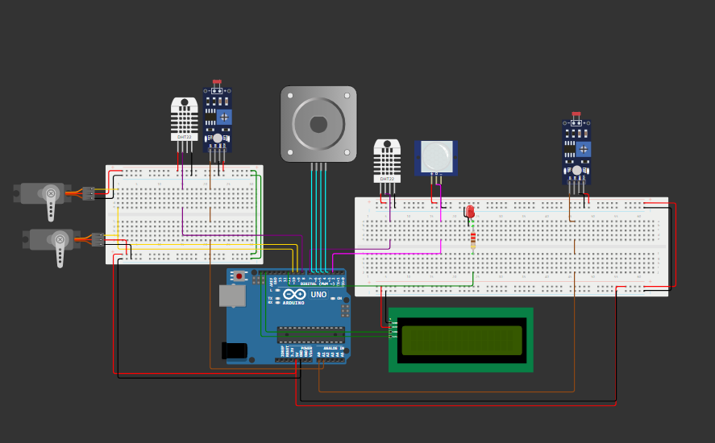
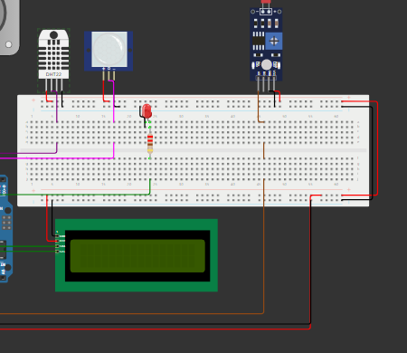

# Sistema_Control_Habitacion

1º Interior 25 objetivo 20 exterior 30 -> Encender ventilador (DC MOTOR)
2º Interior 25 objetivo 20 exterior 20 -> Abrir Ventana (servo)
3º Interior 15 objetivo 20 exterior 10 -> Resistencia de Tico (encender led Rojo)
4º Interior 15 objetivo 20 exterior 25 -> Abrir Ventana (servo)
5º Objetivo es el indicado

Led RGB -> indica estados de funcionamiento de domotica

---
# Simulación

## Introducción

Se va a realizar una simulación en la que se va a realizar un control tanto de la temperatura como de la iluminación mediante un sistema de actuadores y un algoritmo PID, aquí se puede obtener la [simulacion](https://wokwi.com/projects/398885797039480833). El esquema de la simulación es el siguiente:

## Componentes de la simulación

La simulación va a constar de las siguientes partes:

* Una parte interior, donde se terndrán los siguientes sensores:
  
  * Sensor DHT22 para detectar la temperatura interior.
  * Sensor PIR para detectar presencia y despertar el arduino del modo bajo consumo.
  * Un sensor LDR para medira la iluminación interior.

* Una parte exterior, donde se terndrán los siguientes sensores:
  
  * Sensor DHT22 para detectar la temperatura exterior.
  * Un sensor LDR para medira la iluminación exterior.

