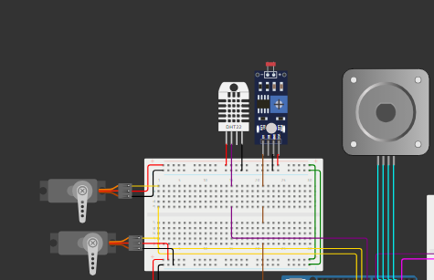

# Sistema_Control_Habitacion

1º Interior 25 objetivo 20 exterior 30 -> Encender ventilador (DC MOTOR)
2º Interior 25 objetivo 20 exterior 20 -> Abrir Ventana (servo)
3º Interior 15 objetivo 20 exterior 10 -> Resistencia de Tico (encender led Rojo)
4º Interior 15 objetivo 20 exterior 25 -> Abrir Ventana (servo)
5º Objetivo es el indicado

Led RGB -> indica estados de funcionamiento de domotica

---
# Simulación

## Introducción

Se va a realizar una simulación en la que se va a realizar un control tanto de la temperatura como de la iluminación mediante un sistema de actuadores y un algoritmo PID, aquí se puede obtener la [simulacion](https://wokwi.com/projects/398885797039480833). El esquema de la simulación es el siguiente:

## Componentes de la simulación

La simulación va a contar con los siguientes actuadores:
* Un servo motor para simular la apertura o cierre de una ventana/ventilación.
* Un servo motor para simular la apertura y cierre de unas persianas.
* Un motor paso a paso, que simulará un ventilador.

Por otro lado, la simulación se divirá en las siguientes partes:

* Una parte interior, donde se tendrán los siguientes sensores:
  
  * Sensor DHT22 para detectar la temperatura interior.
  * Sensor PIR para detectar presencia y despertar el arduino del modo bajo consumo.
  * Un sensor LDR para medira la iluminación interior.

* Una parte exterior, donde se tendrán los siguientes sensores:
  
  * Sensor DHT22 para detectar la temperatura exterior.
  * Un sensor LDR para medira la iluminación exterior.

## Funcionamiento

El sistema se va a encontrar en modo bajo consumo, hasta que detecte una presencia, cuando lo haga todo se pondrá a funcionar y en la pantalla LCD se irán mostrando diferentes pantallas cada 3 segundos, con información sobre temperatura interior y exterior, iluminación exterior e interior y con la iluminación y temperatura de consgina.

Si tras un minuto no se vuelve a detectar presencia, el arduino volvera al modo bajo consumo.

En este apartados se van a explicar el funcionamiento de los actuadores que se han implementado.
### Sistema de actuación de temperatura

Para regular la temperatura tenemos los siguientes actuadores:

* Ventilación:
  
  Este servo motor simula la apertura o cierre de una ventana/un sistema de ventilación. Cuando en el exterior tenemos una temperatura menor que en el interior y en el interior la temperatura es superior a la de consigna, se abrirá esta ventilación para refigerar la habitación. Esto ocurrirá también en el caso contrario de si fuese necesario calentar la habitación.
  
  La posición de 90 grados simula que la ventilación está cerrada, mientras que la posición de 180 grados simula que esta completamente abierta.

* Ventilador:
  
  Este motor paso a paso va a simular las revoluciones de un ventilador, este se activará cuando no se pueda enfriar la habitación con la temperatura exterior y la temperatura interior sea superior a la de consigna.
   

### Sistema de actuación de iluminación

Para regular la iluminación tenemos los siguientes actuadores:

* Persianas:
  
  Este servo motor simula la apertura o cierre de unas persianas. De esta forma cuando en el exterior tengamos mayor iluminación que en el interior u la iluminación interior sea menor a la consigna se abrirán las persianas y en caso contrario se cerrarán.
  
  La posición de 90 grados simula que las persianas está cerrada, mientras que la posición de 180 grados simula que estan abierta.

* LED:
  
  Este LED se va a utilizar mediante PWM para iluminar más o menos dependiendo de si no tenemos iluminación suficiente exterior.
   

---
# MONTAJE

## Introducción

